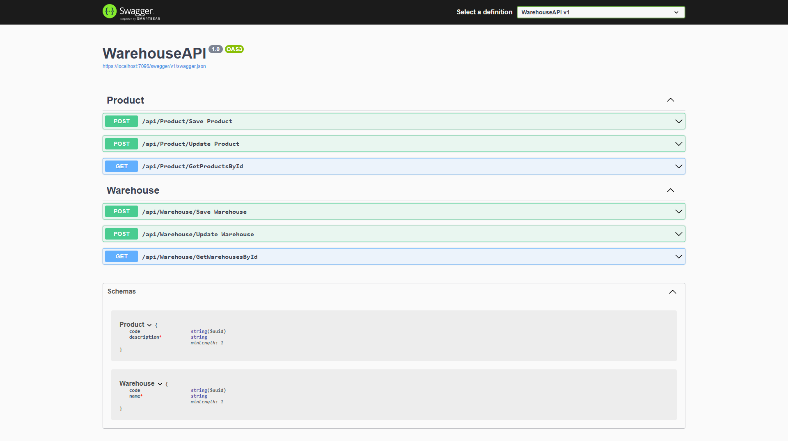

# Warehouse API

## Overview

The Warehouse API is a RESTful service built using .NET to manage products, warehouses, and orders. It supports operations such as creating, updating, and retrieving products and warehouses, and tracking inventory across multiple warehouses.

## Features

- **Product Management**: Create, update, and retrieve product information.
- **Warehouse Management**: Manage warehouses and their details.
- **Inventory Tracking**: Track product quantities across warehouses.
- **Swagger Integration**: Interactive documentation and testing interface.
- **Relational Database**: Backed by Entity Framework Core.

## Getting Started

## **Technologies Used**
- **Framework:** .NET Web API
- **Language:** C#
- **Database:** SQL Server
- **ORM:** Entity Framework Core

### Prerequisites
1. .NET SDK 6 or later installed.
2. SQL Server installed.

### Installation

1. Clone the repository:

    ```bash
    git clone https://github.com/your-repo/WarehouseAPI.git
    cd WarehouseAPI
    ```

2. Install dependencies:

    ```bash
    dotnet restore
    ```

3. Configure the database connection in `appsettings.json`:

    ```json
    {
      "ConnectionStrings": {
        "DefaultConnection": "YourDatabaseConnectionString"
      }
    }
    ```

4. Apply database migrations:

    ```bash
    dotnet ef database update
    ```

5. Run the application:

    ```bash
    dotnet run
    ```

## API Endpoints



### Product Endpoints

| HTTP Method | Endpoint                 | Description                    |
|-------------|--------------------------|--------------------------------|
| POST        | /api/Product/Save         | Saves a new product.           |
| POST        | /api/Product/Update       | Updates an existing product.   |
| GET         | /api/Product/GetProductsById | Retrieves a product by its ID. |

### Warehouse Endpoints

| HTTP Method | Endpoint                     | Description                    |
|-------------|------------------------------|--------------------------------|
| POST        | /api/Warehouse/Save           | Saves a new warehouse.         |
| POST        | /api/Warehouse/Update         | Updates an existing warehouse. |
| GET         | /api/Warehouse/GetWarehousesById | Retrieves a warehouse by its ID. |

## Data Models

### Product Schema

| Field        | Type   | Constraints     | Description                          |
|--------------|--------|-----------------|--------------------------------------|
| code         | string | UUID format     | Unique identifier for the product.   |
| description  | string | Minimum length: 1 | Description of the product.          |

### Warehouse Schema

| Field        | Type   | Constraints     | Description                           |
|--------------|--------|-----------------|---------------------------------------|
| code         | string | UUID format     | Unique identifier for the warehouse.  |
| name         | string | Minimum length: 1 | Name of the warehouse.                |

## Examples

### Save Product

**Request:**

```http
POST /api/Product/Save
Content-Type: application/json
```

**Body:**

```json
{
  "code": "P001",
  "description": "Sample Product"
}
```

**Response:**

```json
{
  "code": "P001",
  "description": "Sample Product"
}
```

### Get Warehouse by ID

**Request:**

```http
GET /api/Warehouse/GetWarehousesById?id=W001
```

**Response:**

```json
{
  "code": "W001",
  "name": "Main Warehouse"
}
```

## Development

### Folder Structure

- **Controllers**: API endpoint definitions.
- **BusinessLayer**: Business logic for products and warehouses.
- **DataLayer**: Entity Framework models and database context.
- **Program.cs**: Application entry point.

### Key Technologies

- **.NET 6**: Framework for API development.
- **Entity Framework Core**: ORM for database interaction.
- **Swagger**: API documentation and testing.
