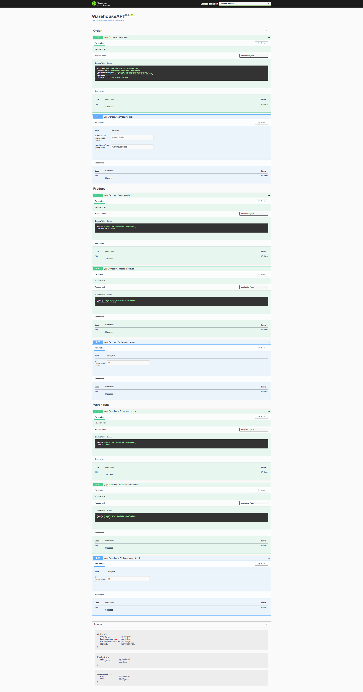

# Warehouse API

## Overview

The Warehouse API is a RESTful service built using .NET to manage products, warehouses, and orders. It supports operations such as creating, updating, and retrieving products and warehouses, tracking inventory across multiple warehouses, and handling order management.

## Features

- **Product Management**: Create, update, and retrieve product information.
- **Warehouse Management**: Manage warehouses and their details.
- **Inventory Tracking**: Track product quantities across warehouses.
- **Order Management**: Create orders and retrieve product stock.
- **Swagger Integration**: Interactive documentation and testing interface.
- **Relational Database**: Backed by Entity Framework Core.

## Getting Started

## **Technologies Used**
- **Framework:** .NET Web API
- **Language:** C#
- **Database:** SQL Server
- **ORM:** Entity Framework Core

### Prerequisites
1. .NET SDK 6 or later installed.
2. SQL Server installed.

### Installation

1. Clone the repository:

    ```bash
    git clone https://github.com/Mxolisi-Tshezi/WarehouseAPI.git
    cd WarehouseAPI
    ```

2. Install dependencies:

    ```bash
    dotnet restore
    ```

3. Configure the database connection in `appsettings.json`:

    ```json
    {
      "ConnectionStrings": {
        "DefaultConnection": "YourDatabaseConnectionString"
      }
    }
    ```

4. Apply database migrations:

    ```bash
    dotnet ef database update
    ```

5. Run the application:

    ```bash
    dotnet run
    ```

## API Endpoints



### Order Endpoints

| HTTP Method | Endpoint                       | Description                          |
|-------------|--------------------------------|--------------------------------------|
| POST        | /api/Order/CreateOrder         | Creates a new order.                 |
| GET         | /api/Order/GetProductStock     | Retrieves product stock details.     |

### Product Endpoints

| HTTP Method | Endpoint                       | Description                          |
|-------------|--------------------------------|--------------------------------------|
| POST        | /api/Product/Save              | Saves a new product.                 |
| POST        | /api/Product/Update            | Updates an existing product.         |
| GET         | /api/Product/GetProductsById   | Retrieves a product by its ID.       |

### Warehouse Endpoints

| HTTP Method | Endpoint                       | Description                          |
|-------------|--------------------------------|--------------------------------------|
| POST        | /api/Warehouse/Save            | Saves a new warehouse.               |
| POST        | /api/Warehouse/Update          | Updates an existing warehouse.       |
| GET         | /api/Warehouse/GetWarehousesById | Retrieves a warehouse by its ID.    |

## Data Models

### Order Schema

| Field                    | Type       | Constraints        | Description                          |
|--------------------------|------------|--------------------|--------------------------------------|
| orderId                 | string     | UUID format        | Unique identifier for the order.     |
| productCode*            | string     | UUID format        | Product code in the order.           |
| sourceWarehouseCode*    | string     | UUID format        | Source warehouse for the order.      |
| destinationWarehouseCode* | string   | UUID format        | Destination warehouse for the order. |
| quantity*               | integer    | Positive values    | Quantity of products in the order.   |
| orderDate               | string     | Date-Time format   | Date of the order.                   |

### Product Schema

| Field        | Type   | Constraints         | Description                          |
|--------------|--------|---------------------|--------------------------------------|
| code         | string | UUID format         | Unique identifier for the product.   |
| description* | string | Minimum length: 1   | Description of the product.          |

### Warehouse Schema

| Field        | Type   | Constraints         | Description                          |
|--------------|--------|---------------------|--------------------------------------|
| code         | string | UUID format         | Unique identifier for the warehouse. |
| name*        | string | Minimum length: 1   | Name of the warehouse.               |

## Examples

### Create Order

**Request:**

```http
POST /api/Order/CreateOrder
Content-Type: application/json
```

**Body:**

```json
{
  "orderId": "3fa85f64-5717-4562-b3fc-2c963f66afa6",
  "productCode": "3fa85f64-5717-4562-b3fc-2c963f66afa6",
  "sourceWarehouseCode": "3fa85f64-5717-4562-b3fc-2c963f66afa6",
  "destinationWarehouseCode": "3fa85f64-5717-4562-b3fc-2c963f66afa6",
  "quantity": 10,
  "orderDate": "2025-01-10T16:50:58.178Z"
}
```

**Response:**

```json
{
  "orderId": "3fa85f64-5717-4562-b3fc-2c963f66afa6",
  "productCode": "3fa85f64-5717-4562-b3fc-2c963f66afa6",
  "sourceWarehouseCode": "3fa85f64-5717-4562-b3fc-2c963f66afa6",
  "destinationWarehouseCode": "3fa85f64-5717-4562-b3fc-2c963f66afa6",
  "quantity": 10,
  "orderDate": "2025-01-10T16:50:58.178Z"
}
```

### Get Product Stock

**Request:**

```http
GET /api/Order/GetProductStock?productCode=3fa85f64-5717-4562-b3fc-2c963f66afa6&warehouseCode=3fa85f64-5717-4562-b3fc-2c963f66afa6
```

**Response:**

```json
{
  "productCode": "3fa85f64-5717-4562-b3fc-2c963f66afa6",
  "warehouseCode": "3fa85f64-5717-4562-b3fc-2c963f66afa6",
  "quantity": 50
}
```

## Development

### Folder Structure

- **Controllers**: API endpoint definitions.
- **BusinessLayer**: Business logic for orders, products, and warehouses.
- **DataLayer**: Entity Framework models and database context.
- **Program.cs**: Application entry point.

### Key Technologies

- **.NET 6**: Framework for API development.
- **Entity Framework Core**: ORM for database interaction.
- **Swagger**: API documentation and testing.
